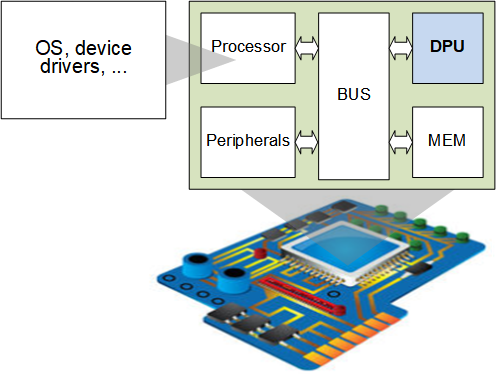
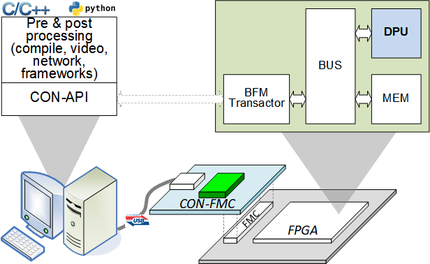
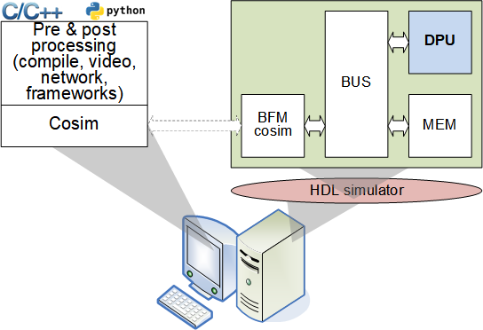
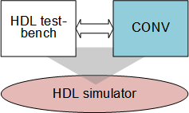
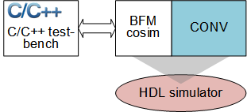
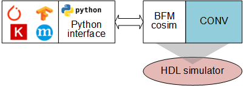
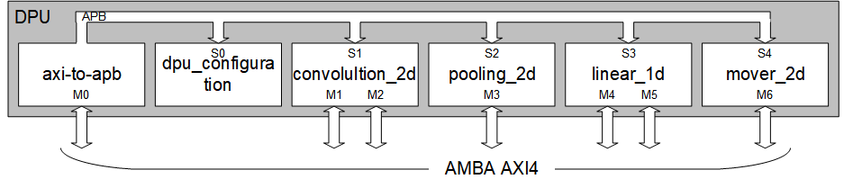
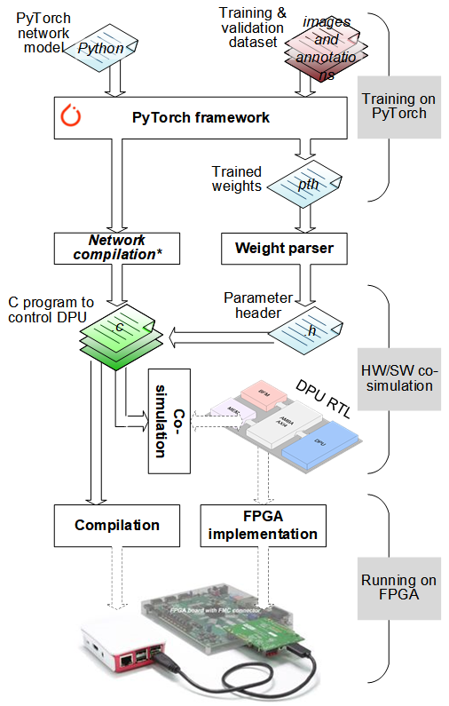

# DLB: Deep Learning Blocks
'***DLB (Deep Learning Blocks)***' as a part of DPU (Deep Learning Processing
Unit) is a collection of synthesizable Verilog modules for deep learning
inference network. 

All contents are provided as it is WITHOUT ANY WARRANTY and NO TECHNICAL SUPPORT
will be provided for problems that might arise.

## Table of contents

Click to expand table of contents

1. [Overview](#overview) 
   1.1 [Prerequisites](#prerequisites) 
   1.2 [Prepareing environment](#environment)
2. [Verification](#verification) 
3. [Deep Learning Blocks](#DLB) 
   3.1 [Concatenation](#concat) 
   3.2 [Convolution](#convolution) 
   3.3 [Linar](#linear) 
   3.4 [Pooling](#pooling) 
   3.5 [Residual](#residual)
4. [Deep Learning Processing Unit](#DPU) 
5. [Projects](#projects) 
   5.1 [Project: LeNet-5](#project_lenet5) 
   5.2 [Project: Tiny Yolo V2](#project_yolo) 
   5.3 [Project: U-Net](#project_unet)
6. [Other things](#other_things) 
   6.1 [Acknowledgment](#acknowledgment) 
   6.2 [Authors and contributors](#authors_and_contributors) 
   6.3 [License](#license) 
   6.4 [Revision history](#revision_history)

&nbsp;&nbsp;

---
# 1. Overview
'DLB (Deep Learning Blocks)' as a part of DPU (Deep Learning Processing
Unit) is a collection of synthesizable Verilog modules for deep learning
inference network.

DLB blocks contain followings (some are under development and more will be added):
* Convolution layer (straightforward 2D convolution)
* Pooling layer (2D max pooling)
* Fully connected layer (1D linear vector-to-matric multiplication)
* Concat layer
* Residual layer (point-to-point adder)
* move, Fill, and so on.

The blocks have following highlights:
* Fully synthesizable Verilog code
* Parameterized to be adopted wide range of usages
* Test-benches for Verilog, C/C++, and PyTorch
* FPGA verified using Future Design Systems’
<a href="http://www.future-ds.com/en/products.html#CON_FMC" target="_blank">CON-FMC</a>

### 1.1 Prerequisites
This program requires followings.
* GNU GCC: C++ compiler
* PyTorch / Conda / Python3
* HDL simulator: Xilinx Xsim (Xilinx Vivado 2019.1 or later)
    - Xilinx Vivado 2017 or earlier version does not support SystemVerilog features that are used in this project.
    - Xilinx Vivado Webpack will be fine, which does not require license.
* FPGA implementation: Xilinx Vivado
* <a href="https://github.com/adki/cosim_bfm_library" target="_blank">HW-SW Co-Simulation Library for AMBA AXI BFM using DPI/VPI</a>
* <a href="https://github.com/github-fds/Deep_Learning_Routines" target="_blank">DLR: Deep Learning Routines</a> (v1.4 for thie project)

### 1.2 Prepare environment
Refer to "[How to Prepare DPU Development Environment](./doc/PrepareLecture_20220125.pdf)".

&nbsp;&nbsp;

---
# 2. Verification

The picture below shows how to verify DLB blocks.

|  |  |  | |  |
|:---:| |:---:| |:---:|
| *DPU on board* | | *DPU on FPGA* | | *DPU HW/SW co-simulation* |

&nbsp;&nbsp;

As shown in the picture below, DLB blocks are verified along with
HDL (Hardware Description Language), C/C++, and Python.

|  ||  || |
|:---:| |:---:| |:---:|
| *DLB with HDL* | | *DLB with C* | | *DLR with Python*|

&nbsp;&nbsp;

---
# 3. Deep Learning Bloks

> It should be noted that the blocks are not optimized to get a higher
> performance since the blocks are for hardware implementation not for
> computation. In addition to this the blocks are only for inference
> not for training.
> For optimized version, contact at
<a href="http://www.future-ds.com" target="_blank">Future Design Systems</a>.

## 3.1 Concatenation
To be added.

## 3.2 Convolution
To be added.

## 3.2 Deconvolution
To be added.

## 3.3 Linear (Fully connected)
To be added.

## 3.4 Pooling
To be added.

## 3.5 Residual
To be added.

&nbsp;&nbsp;

---
# 4. Deep-learning Processing Unit
More details will be added.

|  |
|:---:|
| Deep-learning processing unit |

&nbsp;&nbsp;

---
# 5. Projects

## 5.1 Project: LeNet-5 for MNIST
LeNet-5 is a popular convolutional
neural network architecture for handwritten and
machine-printed character recognition.

Following picture summarizes how to use DPU for LeNet-5 inference network,
in which design flow consists of three major phases.

* Training phase: Training on PyTorch
  * It uses PyTorch framework for modeling and training the LeNet-5 to get trained weights.
* Verification phase: HW/SW co-simulation
  * It uses cosim framework for verifying functionality after preparing DPU RTL and SW.
* Inferencing phase: Running on FPGA
  * It uses CON-FMC frmework to run the model on FPGA along with SW through USB.

This project uses '32-bit floating point' data type and there is no need
to manipulate trainined weights. This project does not have 'network compiler'
that could generate C/C++/Python SW code to control DPU hardware.

## 5.2 Project: Tiny YOLO-V2
More details will be added.

## 5.3 Project: U-Net
More details will be added.

&nbsp;&nbsp;

---
# 6. Other thins

### 6.1 Acknowledgment
The author(s) thanks to all who contributed on this package.

### 6.2 Authors and contributors
* **[Ando Ki]** - *Initial work* - <a href="http://www.future-ds.com" target="_blank">Future Design Systems</a>

### 6.3 License
DLR (Deep Learning Routines) and its associated materials are licensed with
the 2-clause BSD license to make the program and library useful in open and
closed source projects independent of their licensing scheme.
Each contributor holds copyright over their respective contribution.

The 2-Clause BSD License

Copyright 2020-2021 Future Design Systems (http:://www.future-ds.com)

Redistribution and use in source and binary forms, with or without modification, are permitted provided that the following conditions are met:

1. Redistributions of source code must retain the above copyright notice, this list of conditions and the following disclaimer.

2. Redistributions in binary form must reproduce the above copyright notice, this list of conditions and the following disclaimer in the documentation and/or other materials provided with the distribution.

THIS SOFTWARE IS PROVIDED BY THE COPYRIGHT HOLDERS AND CONTRIBUTORS "AS IS" AND ANY EXPRESS OR IMPLIED WARRANTIES, INCLUDING, BUT NOT LIMITED TO, THE IMPLIED WARRANTIES OF MERCHANTABILITY AND FITNESS FOR A PARTICULAR PURPOSE ARE DISCLAIMED. IN NO EVENT SHALL THE COPYRIGHT HOLDER OR CONTRIBUTORS BE LIABLE FOR ANY DIRECT, INDIRECT, INCIDENTAL, SPECIAL, EXEMPLARY, OR CONSEQUENTIAL DAMAGES (INCLUDING, BUT NOT LIMITED TO, PROCUREMENT OF SUBSTITUTE GOODS OR SERVICES; LOSS OF USE, DATA, OR PROFITS; OR BUSINESS INTERRUPTION) HOWEVER CAUSED AND ON ANY THEORY OF LIABILITY, WHETHER IN CONTRACT, STRICT LIABILITY, OR TORT (INCLUDING NEGLIGENCE OR OTHERWISE) ARISING IN ANY WAY OUT OF THE USE OF THIS SOFTWARE, EVEN IF ADVISED OF THE POSSIBILITY OF SUCH DAMAGE.

### 6.3 Revision history
* 2021.08.10: Started by Ando Ki (adki(at)future-ds.com)
